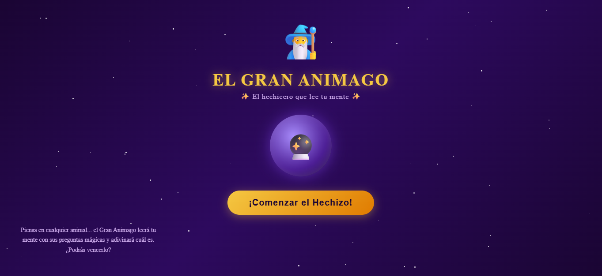
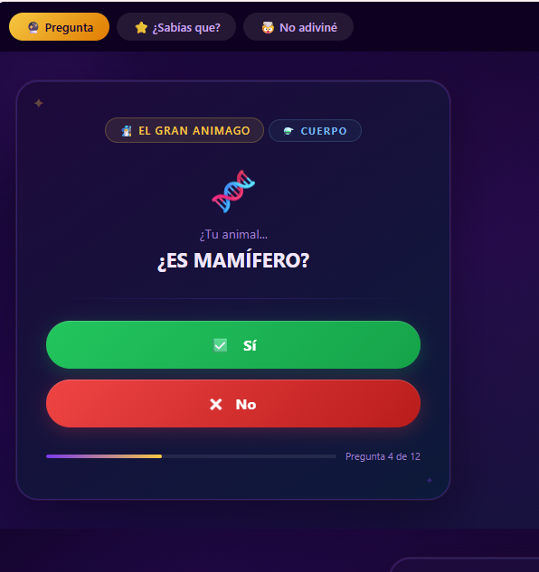
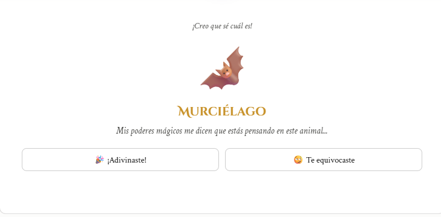
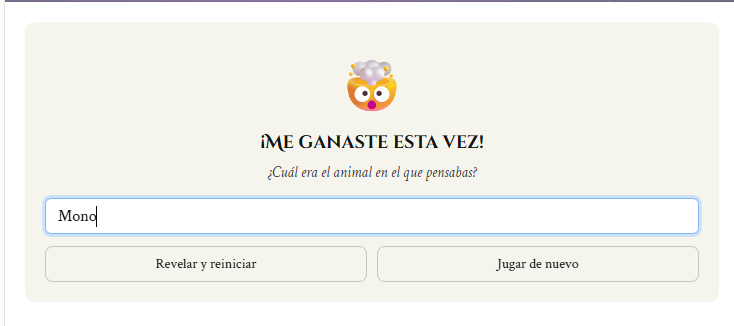

# 🐾 El Gran Animago

Un juego de adivinanza de animales basado en un **árbol de decisión inteligente**, con identidad visual propia.

---

## 📖 Descripción

**El Gran Animago** es un juego interactivo donde el usuario piensa en un animal y el sistema intenta adivinarlo formulando una serie de preguntas, apoyado en un **árbol de decisión dinámico**.

El proyecto fue diseñado y desarrollado de forma individual, cubriendo desde la lógica del motor de decisión hasta la identidad visual y experiencia de usuario.

---

## ✨ Características

* 🧠 Motor de adivinanza basado en un árbol de decisión.
* 🌱 Lógica de aprendizaje incremental: el árbol se expande con cada partida.
* 🎨 Identidad visual propia con paleta de colores morado oscuro y dorado.
* 🖼️ Logo y fondo personalizados.
* 💻 Prototipo funcional desarrollado en HTML, CSS y JavaScript.
* ⚙️ Backend desarrollado en PHP.
* 💾 Persistencia de datos mediante archivos JSON.
* 📚 Documentación técnica desarrollada bajo normas APA.

---

## 📸 Capturas de pantalla

<table>
  <tr>
    <td align="center"><strong>🏠 Pantalla de inicio</strong></td>
    <td align="center"><strong>❓ Flujo de preguntas</strong></td>
    <td align="center"><strong>🎯 Resultado</strong></td>
    <td align="center"><strong>🧠 Aprendizaje</strong></td>
  </tr>
  <tr>
    <td align="center">
      
    </td>
    <td align="center">
      
    </td>
    <td align="center">
      
    </td>
    <td align="center">
      
    </td>
  </tr>
</table>

---

## 🛠️ Stack tecnológico

| Tecnología     | Uso                                |
| -------------- | ---------------------------------- |
| **HTML5**      | Estructura de la aplicación        |
| **CSS3**       | Diseño e identidad visual          |
| **JavaScript** | Lógica e interacción del juego     |
| **PHP**        | Backend y procesamiento            |
| **JSON**       | Persistencia del árbol de decisión |

---

## 📚 Documentación

Este proyecto incluye documentación técnica completa desarrollada bajo **normas APA**:

* 📄 Anteproyecto — propuesta del proyecto.
* 📑 Documento técnico.
* 💼 Plan de negocio con presupuesto estimado.

---

## 🎓 Aprendizajes clave

* Diseño e implementación de estructuras de **árbol de decisión** desde cero.
* Desarrollo de un sistema de **aprendizaje incremental**.
* Persistencia de datos utilizando **JSON** sin necesidad de una base de datos relacional.
* Desarrollo de aplicaciones web utilizando **HTML, CSS, JavaScript y PHP**.
* Diseño de identidad visual y experiencia de usuario **end-to-end**.
* Integración entre frontend, backend y almacenamiento de datos.

---

## 👩‍💻 Autor

**Flor Rubi Torres Delgado**

**Ingeniería en Sistemas Computacionales**
